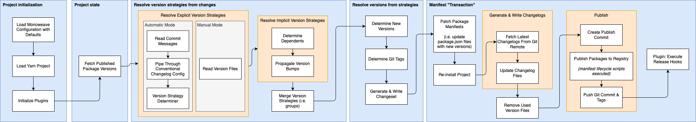

export { Layout as default } from '../components/Layout'

## Architecture

### Code Organization

The Monoweave codebase is a Yarn-monorepo built using Monoweave.

The `packages/cli` directory contains the root `@monoweave/cli` package, which provides a CLI around the programmatic API that is housed in `@monoweave/node`.

### Pipeline

When monoweave is run outside of dry run mode (the default in CI), it executes a number of "pipeline" stages in sequence.

1. Project Initialization: The project is "parsed" using the Yarn Modern APIs. A Yarn-incompatible project will fail at this stage. All configuration is fully resolved and plugins instantiated.
2. Gathering Project State: In this stage we need to determine the "current state" of all workspaces. This ultimately depends on the `RegistryMode` in the monoweave configuration. Note that RegistryMode is evaluated per workspace, so it's possible to have some workspaces pull version information from NPM while others pull from the manifest.
    a. Default / NPM: The latest and/or pre-release tags are fetched for all workspaces from the appropriate NPM registry.
    b. Manifest: The latest tag is read from the workspace's package.json file.
3. Resolving Explicit Version Strategies: In this stage monoweave needs to determine what types of changes to apply to each workspace, starting with "explicit" changes. Version strategy determination (whether a workspace should receive a "patch/minor/major" bump, a "prerelease" bump, or none at all) depends on whether monoweave is running in "automatic" (default/recommended) or "manual" mode. The determination of the version strategies by package is the beginning of the creation of Monoweave's "changeset". This changeset is enhanced a few times throughout the pipeline before ultimately being written out to the changeset file.
    a. Manual: Committed version files are consumed. In manual mode, commit messages are completely ignored.
    b. Automatic: If a conventional changelog configuration is provided, it will be used directly for version determination, otherwise a reasonable default is built-in to monoweave. Commit messages are parsed for information that will determine what type of strategy to apply to each workspace.
4. Resolving Implicit Version Strategies: Once monoweave has a set of workspaces with associated version strategies, it needs to determine implicit strategies. This is accomplished by traversing the dependencies graph and finding all dependents of the explicitly bumped packages, excluding dependents which themselves are explicitly bumped. These dependent packages are automatically given a patch version strategy. This is to ensure downstream consumers of the explicitly bumped packages receive updates. If using package groups (similar to Lerna's fixed mode), the greatest strategy is assumed for each group. Note that if no groups are specified, monoweave defaults to treat each package as its own independent group.
5. Resolving Versions From Strategies: The collection of version strategies associated with the individual workspaces are now read to apply the version strategy (e.g. "minor") to the latest version of each package. Each package group resolves to use the largest version number among the group for each of its members.
6. Update package.json Files: Package manifests (`package.json` files) are updated so the `version` of the manifest, and the versions listed in the `dependencies`, `peerDependencies`, and `devDependencies` fields reflect the latest versions we are about to publish. If `persistVersions` is set to false, the changes to the package.json files will be reverted post-publish. Once the package.json files are updated, Yarn will trigger an install to update the Yarn lockfiles as well as any other install state files.
7. Writing Changelogs: The changeset data assembled in the earlier pipeline stages is formatted and piped through to the loaded conventional changelog config if in automatic mode, or through a built-in changelog writer if using manual mode.
8. Publishing & Lifecycle Script Execution: Depending on configuration options, the changelog files, and the modified package manifests are committed. Once a publish commit has been created, each workspace is published to the appropriate registry according to the workspace's configuration. It's possible to have a project where some workspaces publish to a private registry, some to a public one, and some that aren't published at all (e.g. manifest registry mode). Before and after publishing each package, the appropriate npm lifecycle hooks are executed. These hooks are guaranteed to be executed in topological order, if the topological configuration option is enabled (defaults to enabled). Post-NPM publish, if all is successful, the git commit and tags are pushed to the remote git registry.

At various steps throughout the pipepline, Monoweave plugin hooks will be triggered. Note that most of Monoweave's behaviour can be modified either through simple configuration or plugins.

### Lifecycle Scripts

At various points in the publish lifecycle, Monoweave will execute special lifecycle scripts. If leveraging lifecycle scripts, you'll want to familiarize yourself with this section, since Monoweave may act differently than NPM, Yarn, or Lerna.

There are two types of lifecycle scripts, "pre" scripts and "post" scripts. Monoweave will execute _all_ "pre" scripts prior to actually publishing any packages, even if using topological sort. This enables you to leverage the pre lifecycle hooks to abort the publish early without leaving the repository in a half-published state.

Once all pre scripts are executed, Monoweave publishes the package archive to the specified registry. Post scripts will then run, regardless of whether the publish was successful or not.

You can think of the publish process as being split into distinct stages wherein each stage will execute exactly one type of lifecycle script, while respecting topological sort options while executing that stage. For example, when calling "prepublish", Monoweave will trigger prepublish in topological order (if the topological config option is set) and will _not_ execute the prepack script until _all_ prepublish scripts have completed.

The exact order of lifecycle scripts executed is as follows (this may differ from NPM, Yarn, and Lerna):

1. prepublish
    - This is called before packing even starts. Since NPM will execute this lifecycle script on installs, NPM deprecated this lifecycle script in favour of 'prepublishOnly'. That being said, Yarn Modern _does not_ call prepublishOnly but calls 'prepublish'. Further, Yarn does not call prepublish on install.
2. prepare
    - This is not called by Yarn, however it is called by NPM and by Lerna prior to packing. It is _not recommended_ to leverage this lifecycle hook for compilation.
3. prepublishOnly
    - This is not directly supported by Yarn Modern, however was introduced by NPM as a replacement for the deprecated 'prepublish' script.
4. prepack
    - This is the lifecycle hook that you should be using for any compilation, such as compiling TypeScript to JavaScript. Errors thrown here, or in any early pre lifecycle script, will abort the publish process.
5. <delete>publish</delete>
    - At this "stage" we pack and publish each package. We do not call any 'publish' lifecycle scripts here.
6. postpack
    - This is guaranteed to execute after packing the archive, regardless of failure. This is useful script for build directory cleanup.
7. postpublish
    - This is guaranteed to execute after postpack and is the final lifecycle script called in the publish pipeline. Note that Monoweave will still do work following this lifecycle script, mainly around changelog generation, and git management.
